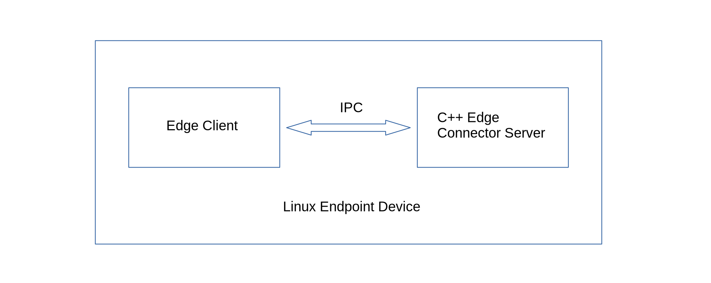

## Edge C/C++ Connector Application (Linux endpoint)


In this quick tour, the edge client will attempt to capture data from a C/C++ connector application through inter-process communication (IPC). 
The client will send a standard json payload {topic:"random-data", method:"node-edge-read", value:""} for network read 
and {topic:"name-data", method:"node-edge-write", payload:"Tony Stark", value:""} for network write. The connector server will then provide a client write result and random value for client read.  

We will use the nlohmann-json (https://github.com/nlohmann/json) library for the *json* data interchange.

### Download the *CppEdgeConnector* demo example project.
```js
$ git clone https://github.com/Node-M2M/CppEdgeConnector.git
```

Install the nlohmann-json library for *json* data interchange in your Linux endpoint.  
```js
$ sudo apt update

$ sudo apt install nlohmann-json3-dev
```

### Edge Tcp C/C++ Connector Device Setup

#### 1. Go inside the *device* sub-directory. 
Check and verify the *device.cpp* source file is the the same as shown below.

```js
#include <memory>
#include <iostream>
#include <nlohmann/json.hpp>
#include "lib/server.h"

using namespace std;
using json = nlohmann::json;

string name = "";

auto getRandomData(json j)
{
    int rn = rand() % 100 + 10;
    string rd = to_string(rn);
    j["value"] = rd;
    return j.dump(); 
}

int main()
{
    cout << "\n*** C++ Tcp Edge Connector Server ***\n" << endl;

    auto s = make_shared<Tcp::Server>(5300);

    cout << "Server listening on: " << s->ip << ":" << s->port << endl;

    for (;;)
    {
        try{
            // wait for a client connection
            s->wait();
          
            // read rcvd data from a client
            auto data = s->read();

            // parse rcvd json string data
            try{
                auto j = json::parse(data);

                if(j["method"] == "node-edge-read" && j["topic"] == "random-data" ){
                    auto rd = std::async(getRandomData, j);
                    rd.wait();
                    auto r = rd.get();
                    s->write(r);
                    cout << "read json string result: " << r << '\n';  
                }
                else if(j["method"] == "node-edge-write" && j["topic"] == "name-data" ){
                    name = j["payload"];
                    if(name == j["payload"]){
                        j["value"] = "write success";
                        s->write(j.dump());
                        cout << "write name: " << name << '\n';  
                        cout << "write json string result: " << j << '\n';  
                    }
                }
                else{
                    cout << "invalid topic:" << s->write("invalid topic") << endl;
                }
                s->end();
            }
            catch (json::parse_error& ex)
            {
                // rcvd data is not a json string 
                cerr << "json parse error at byte: " << ex.byte << endl;
                cout << "rcvd an invalid json data: " << endl;
                s->write("invalid json data"); 
                s->end();
            }
        }
        catch (SocketError& e)
        {
            cerr << "error: " << e.what() << endl;
            exit(1);
        }
    }
  
    return 0;
}
```

#### 2. Compile the *device.cpp* source file.

Make sure you are inside the *device* sub-directory.

```js
$ g++ -Wall -g -pedantic device.cpp -o bin/device -std=c++20
```

#### 3. Run the C/C++ connector application.

```js
$ ./bin/device
```
You should see the C/C++ application running with an output as shown below.

```js
*** C++ Tcp Edge Connector Server ***

Server listening on: 127.0.0.1:5300
```

### Edge Client Setup

#### 1. Go inside the client sub-directory and install m2m.

```js
$ npm install m2m
```

#### 2. Save the code below as client.js in the client directory.
```js
'use strict'

const { Edge } = require('m2m')  

let edge = new Edge()

let d = '', n = 0 

async function main(){

    // authenticate the edge application
    await edge.connect() 

    /**
     * Create an edge client
     */
    let ec = new edge.client({ port:5300, ip:'127.0.0.1', secure:false, restart:false }) 

    // write to connector server
    d = await ec.write('name-data', 'Tony Stark')

    try{
        let jd = JSON.parse(d)
        console.log('ec write name-data result:', jd.value)
        n++
    }
    catch (e){
        console.log('json write parse error: ', d.toString())
    }

    let interval = setInterval(async () => {

        // read from connector server
        d = await ec.read('random-data')

        // stop collecting data after 5 samples
        if(n === 5){
            console.log('no. of sample data', n)
            return clearInterval(interval)
        }     
        
        try{
            let jd = JSON.parse(d)
            console.log('ec read random-data value:', jd.value)
            n++
        }
        catch (e){
            console.log('json read parse error: ', d.toString())
        }

    }, 5000)
}

main()
```
#### 3. Run your client application.
```js
$ node client.js
```
The client should receive *json* data with random values similar as shown below.

```js
ec write name-data result: Tony Stark
ec read random-data value: 35
ec read random-data value: 94
ec read random-data value: 37
ec read random-data value: 46
ec read random-data value: 15
no. of sample data 5
```
